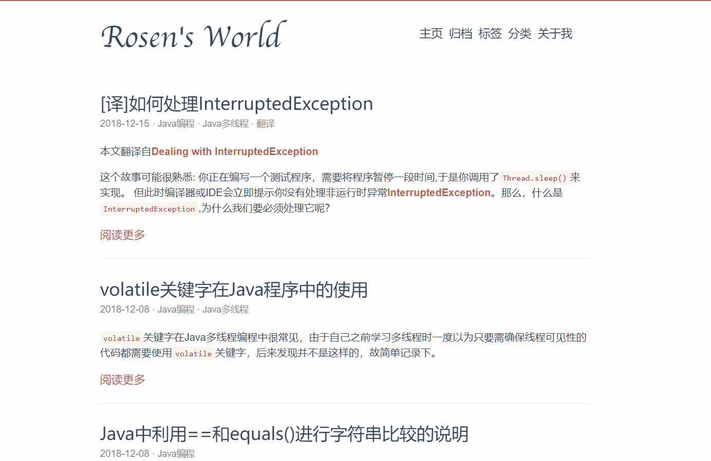

# 我的个人博客
个人博客的源代码和相关说明。

## 技术实现
- 访问地址: **[http://lucumt.info](http://lucumt.info)**
- 博客引擎: **[Hugo](https://gohugo.io/)**
- 域名托管: **[GoDaddy](https://www.godaddy.com)**
- 博客托管: **[Github Pages](https://pages.github.com/)**  

其中[Hugo](https://gohugo.io/)博客引擎的样式由[Red Lounge](https://github.com/tmaiaroto/hugo-redlounge)经过二次改进而来,博客搭建请参见[利用Github Pages和基于Go的Hugo搭建个人博客](http://lucumt.info/posts/create-website-with-hugo/) 

## 博客截图
  

## License

**[MIT License](https://en.wikipedia.org/wiki/MIT_License)**，请在Fork或Download后将 **config.toml**中的 **gaid** 和 **baiduanalysis** 修改为你自己的相关账号，或者直接将这两个账户置为空。  
```
[params] 
sidebartitle = "飞狐的部落格"   
sidebartagline = "Rosen Lu"
photo = "/img/photo.jpg"
highlightstyle="mono-blue"
gaid = "UA-75123653-1"
baiduanalysis="true"
totop = true
```