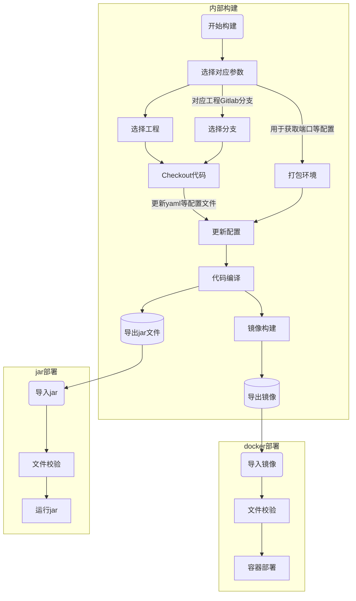

简要介绍

<!--more-->

展示效果

```mermaid
flowchart TD
    subgraph inner [内部构建]
        A1(开始构建) -->A2[选择对应参数]
        A2 -->|用于获取端口等配置| A3[打包环境]
        A2 --> A4[选择工程]
        A2 -->|对应工程Gitlab分支| A5[选择分支]
        A4 --> A6[Checkout代码]
        A5 --> A6
        A6 --> |更新yaml等配置文件| A7[更新配置]
        A3 --> A7
        A7 --> A8[代码编译]
        A8 --> A9[(导出jar文件)]
        A8 --> A10[镜像构建]
        A10 --> A11[(导出镜像)]
    end
    subgraph docker部署
        B1(导入镜像) --> B2[文件校验] --> B3[容器部署]
    end
    subgraph jar部署
        C1(导入jar) --> C2[文件校验] --> C3[运行jar]
    end
    A11 --> B1
    A9 --> C1
```

