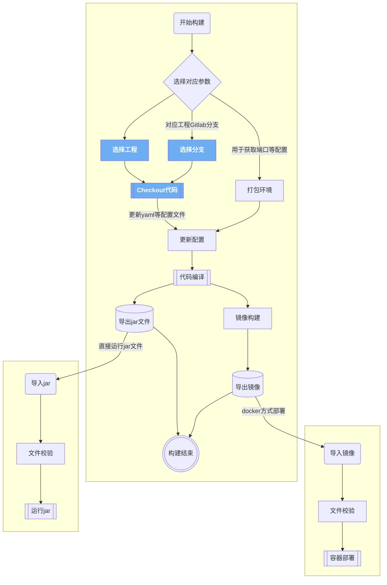

<style>
div.mermaid > svg { max-width: 60% !important; }
</style>

简要介绍如何在[KubeSphere](https://kubesphere.io/zh/)中使用[Jenkins](https://www.jenkins.io/)基于用户选择的不同[GitLab](https://gitlab.com)工程模块利用[Git](https://git-scm.com/)进行动态的代码下载和编译构建，**将多条流水线缩减为一条，减少`Jenkins`流水线的开发与维护成本**。

<!--more-->

## 背景

在[利用Nacos与KubeSphere创建多套开发与测试环境](/post/devops/using-nacos-and-kubesphere-to-create-multiple-environments/)一文中介绍了部门基于`KubeSphere`和`Nacos`来动态的创建多套开发与测试环境，此种方式虽然在公司内部使用起来很灵活，但当需要交付给客户时会存在如下问题导致`KubeSphere`不适合部署给客户使用:

1. 客户使用环境的网络无法接入公司网络，无法下载代码
2. 客户使用环境不一定有`Kubernetes`环境，无法部署pod节点

由于`docker`的安装相对`Kubernetes`而言会简单很多，故决定采用`docker`容器的形式在客户现场部署运行软件，相关流程如下：
 

实际使用时在公司内部提前打包好对应的`docker`镜像并导出，然后在客户环境导入对应的`docker`镜像并运行即可，通过此种方式可有效的避免对于公司内部特定环境和配置的依赖。


为实现上述目的，可通过[docker save](https://docs.docker.com/engine/reference/commandline/save/)先导出镜像，然后使用`Jenkins`的[archiveArtifacts](https://www.jenkins.io/doc/pipeline/steps/core/#archiveartifacts-archive-the-artifacts)功能导出镜像文件即可，这样看来问题似乎很容易解决，直接修改原有的`Jenkins`流水线即可。由于不同项目模块在使用上会有细微的差异，同时处于简化开发和维护的考虑，目前部门的使用方式是**每个工程对应一条`Jenkins`流水线**，这样导致每条流水线都需要修改，工作量且不利于后续的扩展！

 

基于上述原因，最终的实现方案如下

{} 

**部门内部研发测试使用的构建流水线与要交付给客户的产品构建流水线分开创建与使用，且交付构建的流水线数目要尽可能少，便于后续维护与定制化扩展**

 {}

下图展示了更详细的使用流程，在该图中引出了我们的问题

{} 

**如何在Jenkins中只通过一条流水线根据用户选择的工程模块来动态的下载代码?**

 {}



## 解决思路

由于最初是每个工程项目都有一个单独的`Jenkins`流水线，故在通过`Git`下载代码时采用的是类似下图的直接写死`Gitlab`工程仓库地址的方式，很明显此种方式不满足要求。

```groovy
stage('拉取代码') {
    agent none
    steps {
        // git仓库地址直接以字符串方式写死
        git(credentialsId: 'gitlab-account', url: 'http://gitlab.xxx.com/lucumt-group/system.git', branch: '$BRANCH_NAME', changelog: true, poll: false)
    }
}
```

在网上搜索后发现一篇文章[dynamically-selecting-git-repo-in-jenkins-job](https://stackoverflow.com/questions/56421553/dynamically-selecting-git-repo-in-jenkins-job),其采用`parameters`实现，将`Gitlab`仓库的地址存储在一个变量中，然后`Git`下载时实际计算变量值并进行下载。此方案看起来符合要求，进一步查找后发现`parameters`本身无法直接修改[^1]，不满足使用要求。

由于先前对代码分支名称的获取可通过`$BRANCH_NAME`来实现，自己尝试采用类似的方式来验证，最终找到了符合要求的实现方案

 

下图展示了完整的使用链路，可发现其实现复杂度不是很高

 

## 展示效果

运行结果如下：

 

相关流水线参考如下：

| 流水线                                                       | 作用                                       | 备注                        |
| ------------------------------------------------------------ | ------------------------------------------ | --------------------------- |
| **[lucumt-server-image-build.groovy](https://github.com/lucumt/myrepository/blob/master/jenkins/lucumt-server-image-build.groovy)** | 服务器端打包流水线，产出物为**docker镜像** |                             |
| **[lucumt-front-image-build.groovy](https://github.com/lucumt/myrepository/blob/master/jenkins/lucumt-front-image-build.groovy)** | 前端打包流水线，产出物为**docker镜像**     |                             |
| **[lucumt-server-jar-build.groovy](https://github.com/lucumt/myrepository/blob/master/jenkins/lucumt-server-jar-build.groovy)** | 服务器端打包流水线，产出物为**jar文件**    | 可直接用`Java`运行该jar文件 |
| **[lucumt-front-dist-build.groovy](https://github.com/lucumt/myrepository/blob/master/jenkins/lucumt-front-dist-build.groovy)** | 服务器端打包流水线，产出物为**zip文件**    | `nodejs`编译后的文件压缩    |


[^1]:https://stackoverflow.com/questions/61789938/change-jenkins-param-variable-value


