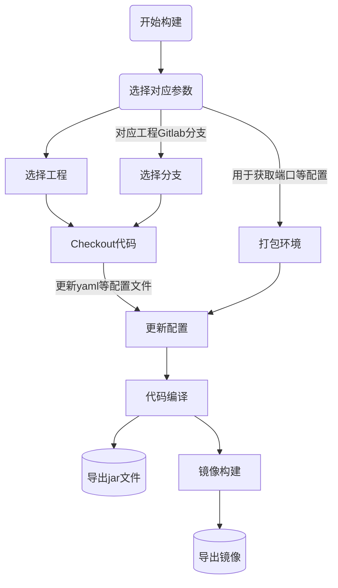

简要介绍

<!--more-->

展示效果

```mermaid
flowchart TD
    A(开始构建) -->B(选择对应参数)
    B -->|用于获取端口等配置| C[打包环境]
    B --> D[选择工程]
    B -->|对应工程Gitlab分支| E[选择分支]
    D --> F[Checkout代码]
    E --> F
    F --> |更新yaml等配置文件| G[更新配置]
    C --> G
    G --> H[代码编译]
    H --> I[(导出jar文件)]
    H --> J[镜像构建]
    J --> K[(导出镜像)]
```

