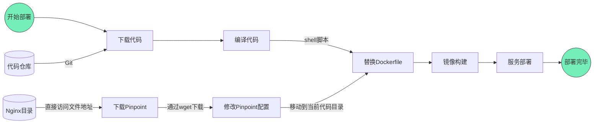

简要记录如何基于`docker-compose`的方式安装`Pinpoint`，以及基于`Dockerfile`与`Jenkins`流水线将项目添加到`Pinpoint`中进行实时监控。

<!--more-->

## docker-compose安装

按照下述指令安装`docker-compose`:

```bash
# 下载安装docker-compose
curl -L https://get.daocloud.io/docker/compose/releases/download/1.29.2/docker-compose-`uname -s`-`uname -m` > /usr/local/bin/docker-compose

# 将其设置为可执行
chmod +x /usr/local/bin/docker-compose

# 验证是否安装正确
docker-compose version
```

## Pinpoint安装与测试

1. 在终端执行下述指令下载`Pinpoint`全家桶并解压该文件

   ```bash
   wget https://github.com/pinpoint-apm/pinpoint-docker/archive/refs/tags/2.2.2.tar.gz
   tar -zxvf 2.2.2.tar.gz
   ```

2. 进入该目录，可发现其把相关的组件都下载完毕

   

3. 在该目录下创建一个名为`start.sh`的脚本文件，写入如下内容

   ```bash
   #!/bin/bash
   docker-compose up -d zoo1 zoo2 zoo3 pinpoint-quickstart pinpoint-hbase pinpoint-agent pinpoint-web pinpoint-collector
   ```

4. 执行下述命令启动`Pinpoint`全套的服务

   ```bash
   bash start.sh
   ```

   若一切正常约5-10秒左右就会启动完毕，执行输出类似如下(第一次执行时会下载相关的镜像，此时耗时较长)

   

5. `Pinpoint`默认的服务器端口在`pinpoint-web`下的`.env`配置文件中，默认值为`8079`，可根据实际情况修改

   

6. 在浏览器中输入`http://IP:8079`若出现类似如下界面，则表示`Pinpoint`安装成功！

   

7. 若想关闭`Pinpoint`服务，同样可在该目录下创建一个名为`stop.sh`的脚本，写入如下内容，然后执行该脚本即可

   ```bash
   #!/bin/bash
   docker-compose down zoo1 zoo2 zoo3 pinpoint-quickstart pinpoint-hbase pinpoint-agent pinpoint-web pinpoint-collector
   ```

## 将新系统接入Pinpoint

目前的接入方案是在通过`Jenkins`部署时，通过脚本的方式自动替换相关的文件，然后打包部署，流程图如下



相关的参考配置如下：

* 利用`Nginx`搭建一个静态的文件下载服务器，核心配置如下

  ```nginx
  server {
          listen       8788;
          server_name  zip-download;
  
          location ~.*\.(gz|zip)$ {
                  root /root/idp/;
                  # 自动创建目录文件列表为首页
                  autoindex on;
                  # 自动首页的格式为html
                  autoindex_format html;
                  # 关闭文件大小转换
                  autoindex_exact_size off;
                  # 按照服务器时间显示文件时间
                  autoindex_localtime on;
  
                  default_type application/octet-stream;
                  # 开启零复制。默认配置中，文件会先到nginx缓冲区，开启零复制后，文件跳过缓冲区，可以加快文件传输速度。
                  sendfile on;
                  # 限制零复制过程中每个连接的最大传输量
                  sendfile_max_chunk 1m;
                  # tcp_nopush与零复制配合使用，当数据包大于最大报文长度时才执行网络发送操作，从而提升网络利用率。
                  tcp_nopush on;
                  # 启用异步IO，需要配合direcio使用
                                          # aio on;
                  # 大于10MB的文件会采用直接IO的当时进行缓冲读取
                  directio 10m;
                  # 对齐文件系统块大小4096
                  directio_alignment 4096;
                  # 启用分块传输标识
                  chunked_transfer_encoding on;
                  # 文件输出的缓冲区大小为128KB
                  output_buffers 4 32k;
          }
  
          location / {
                  root   html;
                  index  index.html index.htm;
          }
      
          error_page   500 502 503 504  /50x.html;
  
  }
  ```

* 在`Docker`镜像构建时，添加上`Pinpoint`相关的配置，`Dockerfile`内容如下

  ```dockerfile
  FROM  openjdk:8-jdk
  LABEL maintainer=lucumt@gmail.com
  
  RUN mkdir -p /home/xxxx
  WORKDIR /home/xxxx
  
  ARG DEPLOY_NAME
  ARG PRODUCT_PHASE
  ARG NODE_PORT
  ENV PARAMS1="${DEPLOY_NAME}.jar"
  ENV PARAMS2="--server.port=${NODE_PORT} --spring.application.name=${DEPLOY_NAME} --spring.profiles.active=${PRODUCT_PHASE}"
  RUN /bin/cp /usr/share/zoneinfo/Asia/Shanghai /etc/localtime && echo 'Asia/Shanghai' >/etc/timezone
  
  ARG PROJECT_VERSION
  ENV BUILD_FILE="${DEPLOY_NAME}/target/${DEPLOY_NAME}-${PROJECT_VERSION}.jar"
  RUN echo "build file version: ${BUILD_FILE}"
  COPY ${BUILD_FILE} /home/xxxx/${PARAMS1}
  COPY pinpoint /home/xxxx/pinpoint
  RUN ls
  # 添加Pinpoint相关的依赖
  ENV AGENT="-javaagent:/home/xxxx/pinpoint/pinpoint-bootstrap-1.8.5.jar -Dpinpoint.agentId=${PRODUCT_PHASE} -Dpinpoint.applicationName=${DEPLOY_NAME}"
  ENTRYPOINT ["/bin/sh","-c","java ${AGENT} -Dfile.encoding=utf8 -jar ${PARAMS1} ${PARAMS2}"]
  ```
  
* 在`Jenkins`中采用`Shell`脚本对`Dockerfile`进行替换并打包，对应的流水线代码如下，其核心为通过`profiler.collector.ip`指定`Pinpoint`服务器的IP地址，对于`SpringBoot`项目，将`actuator`健康检查的接口屏蔽掉，避免在`Kubernetes`等环境下干扰使用

  ```groovy
   stage('镜像构建') {
        agent none
        steps {
          container('maven') {
          sh '''
          if [ ${PRODUCT_PHASE} = 'dev-8' ]; then
               echo "部署的脚本模块为comm 且需要下载pinpoint"
               wget -nv http://aeectss.xxxx.local:8788/pinpoint/pinpoint-agent-1.8.5.tar.gz
               mkdir pinpoint
               tar -xf pinpoint-agent-1.8.5.tar.gz -C pinpoint
               rm -rf pinpoint-agent-1.8.5.tar.gz
               sed -i "s/profiler.collector.ip=127.0.0.1/profiler.collector.ip=10.0.18.119/g" pinpoint/pinpoint.config
               sed -i "s/profiler.tomcat.excludeurl=\\/aa\\/test.html, \\/bb\\/exclude.html/profiler.tomcat.excludeurl=\\/comm\\/actuator\\/health/g" pinpoint/pinpoint.config
               #cat pinpoint/pinpoint.config
               cd kubesphere
               rm Dockerfile
               mv Dockerfile_Pinpoint Dockerfile
               cd ..
          fi
          '''
            script {
              deployNameList.each{
                env.DEPLOY_NAME = it
                env.NODE_PORT = nodePortMapp[it]
                env.JAVA_OPTS = javaOptsMapp[it]
                sh '''docker build -f kubesphere/Dockerfile \\
                -t $DEPLOY_NAME-$PRODUCT_PHASE:$BUILD_TAG  \\
                --build-arg  DEPLOY_NAME=$DEPLOY_NAME \\
                --build-arg  PROJECT_VERSION=$PROJECT_VERSION \\
                --build-arg  NODE_PORT=$NODE_PORT \\
                --build-arg  JAVA_OPTS="$JAVA_OPTS" \\
                --build-arg  PRODUCT_PHASE=$PRODUCT_PHASE .'''
              }
              
            }
          }
        }
      }
  ```

实际访问效果如下，可发现在主页中能够显示相关项目

