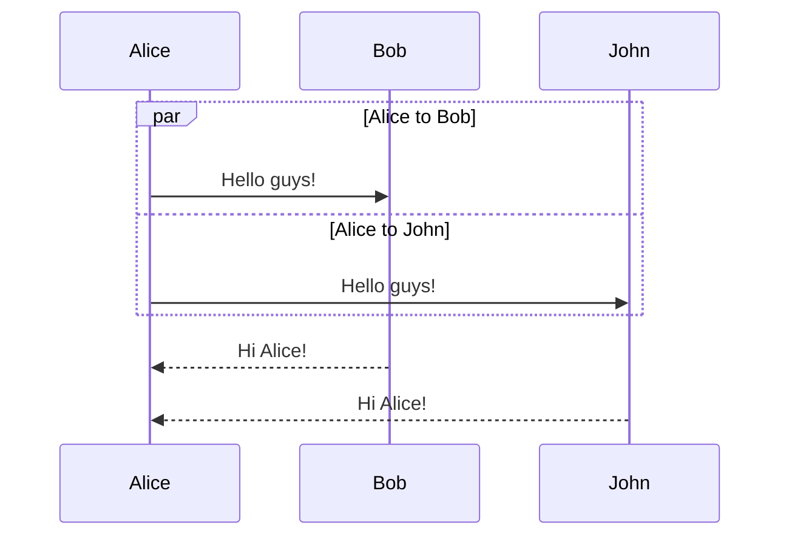

简要说明如何给`GitBook`中的`SVG`图像提供缩放和下载功能，实现可对复杂的`SVG`图像进行缩放和下载。

<!--more-->

## 背景

在项目开发流程中个人习惯采用`Mermaid`中的[**Sequence diagrams**](https://mermaid.js.org/syntax/sequenceDiagram.html)组件通过画[**时序图**](https://zh.wikipedia.org/zh-cn/%E6%97%B6%E5%BA%8F%E5%9B%BE)的方式来描述复杂的业务逻辑并将其用`GitBook`呈现出来便于共享阅读，类似如下



随着使用的增多发现一个问题，当用该图表来描述复杂的业务逻辑时，由于参与者和相互调用流程特别多，生成的时序图特别密集，根本无法查看，类似如下


由于`Mermaid`生成的图表都是以[**SVG**](https://zh.wikipedia.org/zh-hk/%E5%8F%AF%E7%B8%AE%E6%94%BE%E5%90%91%E9%87%8F%E5%9C%96%E5%BD%A2)形式呈现的，而`SVG`图像的特性是不管放大多少倍都不会失真，如果能通过某种方式将对应的`SVG`下载下来，之后用浏览器即可进行放大缩小来查看具体的细节，则岂不是能解决此问题？


更进一步的，如果直接在页面上提供放大缩小功能，就能避免将对应`SVG`文件下载到本地，使用起来岂不是更方便？而`SVG`的缩放功能`GitHub`上有很多已有的实现，理论分析完全可行！

## 实现

### 缩放功能

在`GitHub`上对比相关的`SVG`组件后，最终选定[**svg-pan-zoom**](https://github.com/bumbu/svg-pan-zoom)作为`SVG`功能扩展度的实现，正好自己之前改进过一个基于`Mermaid`的`GitBook`插件[**gitbook-plugin-mermaid-fox**](https://github.com/gitbook-plugin-fox/gitbook-plugin-mermaid-fox)，可将`svg-pan-zoom`相关的功能整合到该插件中，后续`GitBook`中升级插件版本即可。

在`svg-pan-zoom`的官方文档中可找到该组件的用法，十分简单

```javascript
var panZoomTiger = svgPanZoom('#demo-tiger');
// or
var svgElement = document.querySelector('#demo-tiger')
var panZoomTiger = svgPanZoom(svgElement)
```

调用`svgPanZoom`时还可根据实际情况添加各种配置

```javascript
svgPanZoom('#demo-tiger', {
  viewportSelector: '.svg-pan-zoom_viewport', 
  panEnabled: true, 
  controlIconsEnabled: false, 
  zoomEnabled: true, 
  dblClickZoomEnabled: true,
  mouseWheelZoomEnabled: true,
  preventMouseEventsDefault: true,
  zoomScaleSensitivity: 0.2,
  minZoom: 0.5,
  maxZoom: 10,
  fit: true,
  contain: false,
  center: true,
  refreshRate: 'auto',
  beforeZoom: function(){},
  onZoom: function(){},
  beforePan: function(){},
  onPan: function(){},
  onUpdatedCTM: function(){},
  customEventsHandler: {},
  eventsListenerElement: null
});
```

之后要找到`Mermaid`渲染图表结束时的回调方法，在其官网上没有找到相关的说明，但通过Google发现在`GitHub`上有[相关说明](https://github.com/mermaid-js/mermaid/issues/176)，核心代码如下

```javascript
import mermaid from '${src}';
mermaid.run({
    querySelector: '.mermaid',
    postRenderCallback: (id) => {
        console.log(id);
    }
});
```

很显然可通过在`postRenderCallback`回调方法中添加我们自己的逻辑，相关的代码如下

```javascript
mermaid.run({
    querySelector: '.mermaid',
    postRenderCallback: (id) => {
        let ele = document.getElementById(id);
        let svg = ele.getBBox();
        let height = svg.height;
        let aHeight = height > 800 ? 800 : height;
        ele.setAttribute('style','height: '+aHeight+'px;overflow:scroll;');
        let panZoomTiger = svgPanZoom('#'+id,{
            zoomEnabled: true,
            controlIconsEnabled: true
        });
        panZoomTiger.resize();
        panZoomTiger.updateBBox();
    }
});
```

至此`SVG`缩放功能整合完毕，接下来需要研究下载功能。

### 下载功能

由于`SVG`图像一般都是以源码的方式直接嵌入`HTML`页面中，故其下载功能较为简单，只需要找到对应的DOM节点，通过`JavaScript`相关的技术获取到其完整的内容，然后下载到本地即可。


首先自己基于网络上的[相关资料](https://stackoverflow.com/questions/54626186/how-to-download-file-with-javascript)找到如下代码，本地验证下载`txt`时能正常工作。

```javascript
function downloadURI(uri, name) {
    var link = document.createElement("a");
    link.download = name;
    link.href = uri;
    link.click();
}
```

但当用其测试`SVG`下载时，下载的文件一直为空且浏览器也没提示任何错误，多次搜索发现Chrome出于安全考虑，默认情况下不允许通过`JavaScript`下载`SVG`文件，需要做一些特殊处理来规避此限制， 继续查找后找到[一篇说明](https://stackoverflow.com/questions/23218174/how-do-i-save-export-an-svg-file-after-creating-an-svg-with-d3-js-ie-safari-an)，其中给出了如下的解决方案，经本地测试可行。

```javascript
function downloadSvg() {
    var svg = document.getElementById("svg");
    var serializer = new XMLSerializer();
    var source = serializer.serializeToString(svg);
    source = source.replace(/(\w+)?:?xlink=/g, 'xmlns:xlink='); // Fix root xlink without namespace

    source = source.replace(/ns\d+:href/g, 'xlink:href'); // Safari NS namespace fix.


    if (!source.match(/^<svg[^>]+xmlns="http\:\/\/www\.w3\.org\/2000\/svg"/)) {
        source = source.replace(/^<svg/, '<svg xmlns="http://www.w3.org/2000/svg"');
    }
    if (!source.match(/^<svg[^>]+"http\:\/\/www\.w3\.org\/1999\/xlink"/)) {
        source = source.replace(/^<svg/, '<svg xmlns:xlink="http://www.w3.org/1999/xlink"');
    }


    var preface = '<?xml version="1.0" standalone="no"?>\r\n';
    var svgBlob = new Blob([preface, source], { type: "image/svg+xml;charset=utf-8" });
    var svgUrl = URL.createObjectURL(svgBlob);
    var downloadLink = document.createElement("a");
    downloadLink.href = svgUrl;
    downloadLink.download = name;
    document.body.appendChild(downloadLink);
    downloadLink.click();
    document.body.removeChild(downloadLink);
}
```

缩放与下载功能分别验证完毕后，接下来只需将其整合到对应的`GitBook`插件中即可，完整代码参见[**gitbook-plugin-mermaid-fox**](https://github.com/gitbook-plugin-fox/gitbook-plugin-mermaid-fox)。

### 显示效果

添加缩放和下载按钮后后默认显示效果如下，其中下载按钮位于右上角，缩放按钮位于右下角


通过图中的按钮或鼠标滚轮放大后的效果如下，可以看出基本满足需求


### 相关代码

修改过程中主要涉及到`index.js`和`plguin.js`这两个文件，同时需要把`svg-pan-zoom.js`文件放到相关目录下以方便加载

* `index.js`用于文件加载

  ```javascript
  function processMermaidBlockList(page) {
    const mermaidRegex = /^[ \t]*```\s*mermaid[ \t]*$([^`]*(?:`[^`]+)*)```$/igm;
    let download='<svg width="15" height="15" viewBox="0 0 8 8" fill="#707070" xmlns="http://www.w3.org/2000/svg"><path d="m3 0v3h-2l3 3 3-3h-2v-3zm-3 7v1h8v-1z"/></svg>';
    page.content = page.content.replace(mermaidRegex, '<div><div class="download" style="float:right;padding-right:35px;cursor:pointer">'
                  +download+'</div><div class="mermaid">$1</div></div>');
    return page;
  }
  
  module.exports = {
    website: {
      assets: 'dist',
      css: [
        'mermaid/mermaid.css'
      ],
      js: [
        'book/plugin.js',
	    'book/svg-pan-zoom.js'
      ]
    },
    hooks: {
      'page:before': processMermaidBlockList
    }
  };
  ```

* `plugin.js`核心代码

  ```javascript
  require([
    'gitbook'
  ], function (gitbook) {
    gitbook.events.bind('page.change', function () {
      mermaid.run({
          querySelector: '.mermaid',
          postRenderCallback: (id) => {
  		  let ele = document.getElementById(id);
			  let svg = ele.getBBox();
  		  let height = svg.height;
  		  let aHeight = height > 800 ? 800 : height;
  		  ele.setAttribute('style','height: '+aHeight+'px;overflow:scroll;');
  		  let panZoomTiger = svgPanZoom('#'+id,{
  			  zoomEnabled: true,
  			  controlIconsEnabled: true
  		  });
  		  panZoomTiger.resize();
  		  panZoomTiger.updateBBox();
  		  
  		  let download = ele.parentNode.previousSibling;
  		  download.addEventListener('click',e => {
  			  downloadData(id, ele);
  		  });
          }
      });
    });
  });
  
  function downloadData(id,ele) {
  	
  	let svg = ele.cloneNode(true);
	
		// remove svg-pan-zoom-controls for the download file
  	svg.getElementById("svg-pan-zoom-controls").remove();
  	
  	let serializer = new XMLSerializer();
  	let source = serializer.serializeToString(svg);
  	source = source.replace(/(\w+)?:?xlink=/g, 'xmlns:xlink='); // Fix root xlink without namespace
  	source = source.replace(/ns\d+:href/g, 'xlink:href'); // Safari NS namespace fix.
  
      if (!source.match(/^<svg[^>]+xmlns="http\:\/\/www\.w3\.org\/2000\/svg"/)) {
  		source = source.replace(/^<svg/, '<svg xmlns="http://www.w3.org/2000/svg"');
  	}
  	if (!source.match(/^<svg[^>]+"http\:\/\/www\.w3\.org\/1999\/xlink"/)) {
  		source = source.replace(/^<svg/, '<svg xmlns:xlink="http://www.w3.org/1999/xlink"');
  	}
  
  	let preface = '<?xml version="1.0" standalone="no"?>\r\n';
  	let svgBlob = new Blob([preface, source], { type: "image/svg+xml;charset=utf-8" });
  	let svgUrl = URL.createObjectURL(svgBlob);
  	let downloadLink = document.createElement("a");
  	let name = id + '.svg';
  	
  	downloadLink.download = name;
  	downloadLink.href = svgUrl;
  	document.body.appendChild(downloadLink);
  	downloadLink.click();
  	document.body.removeChild(downloadLink);
  }
  ```
