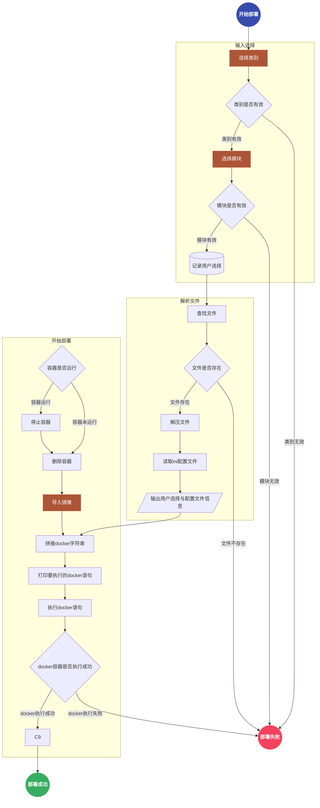

基于[在Jenkins中根据配置从不同的仓库中Checkout代码](/post/devops/git-checkout-by-dynamic-repository-in-jenkins/)一文，说明如何利用`shell`脚本在`Linux`系统中实现自动化的部署与升级。

<!--more-->

## 流程图

整体流程如下图所示：

1. 首先让用户选择要升级的类别和模块，并对用户选择进行校验，若不合法则升级过程终止
2. 根据用户选择去相关目录下查看对应的文件是否存在，若不存在则升级过程终止
3. 若文件存在则对其进行解压，并读取其中的配置文件信息[^1]
4. 检查对应的容器，将其停止并删除
5. 导入相关镜像
6. 拼接`docker`语句并执行，展示执行结果

<style>
div.mermaid > svg { max-width: 70% !important; }
</style>



## 使用说明

此部分操作主要基于前述的流程以`shell`脚本的形式实现，相关源码参见[**deploy.sh**](https://github.com/lucumt/myrepository/blob/master/linux/docker_image_deploy.sh)，具体操作流程如下：

* 将`deploy.sh`拷贝到`Linux`服务器的某个目录下，然后在该目录下建立一个名为**`target`**的目录，将导出的镜像文件放到`target`目录下

  

* 执行`./deploy`命令并按下`Enter`键，终端会出现如下输出，让我们选择要升级的系统为前端还是后端

  

* 根据提示选择对应的类别，若升级类型为前端则输入1，若升级类型为后端则输入2，之后按下Enter键则系统会进一步提示选择对应的模块

  

  若输入的类型不合法，则升级脚本会给出对应的提示，同时整个升级过程立即终止

  

* 若要部署的模块在`target`目录下不存在或选择的模块不是选择列表的模块，升级脚本同样会给出提示，同时整个升级过程立即终止

  

  若部署的模块在`target`目录下存在多份，则会根据文件名中附带的时间戳进行排序，寻找最近的一份文件进行升级

  ```bash
  # 校验升级文件是否存在
  file=$(ls target|sort -r|grep ${module}_20|head -1) # 此条指令根据文件名按时间倒排，取第一个文件来升级
  if [[ -z "$file" ]]
  then
  printf "\033[31mtarget目录下没有对应的文件，升级操作终止，请重新执行./deploy.sh\033[0m\n"
  exit 0
  fi
  ```

* 若选择的模块合法，且升级过程一切顺利，Linux终端会输出类似如下信息，提示整个升级过程完成!

  

* 若升级过程中遇到错误，系统同样会给出提示，可根据错误信息进行初步排查

  

## 待优化点

* 升级过程缺少记录，无法查看在特定时间范围通过该脚本执行升级的次数，可通过写入文件实现简单的数据库记录
* 缺少回退功能，在最后启动`docker`容器失败是，应能将之前关闭的服务启动，确保能持续对外提供服务
* 对于集群方式部署的`docker`容器缺少兼容性

[^1]:此信息在部署过程中会输出，用于确认版本和配是否正确